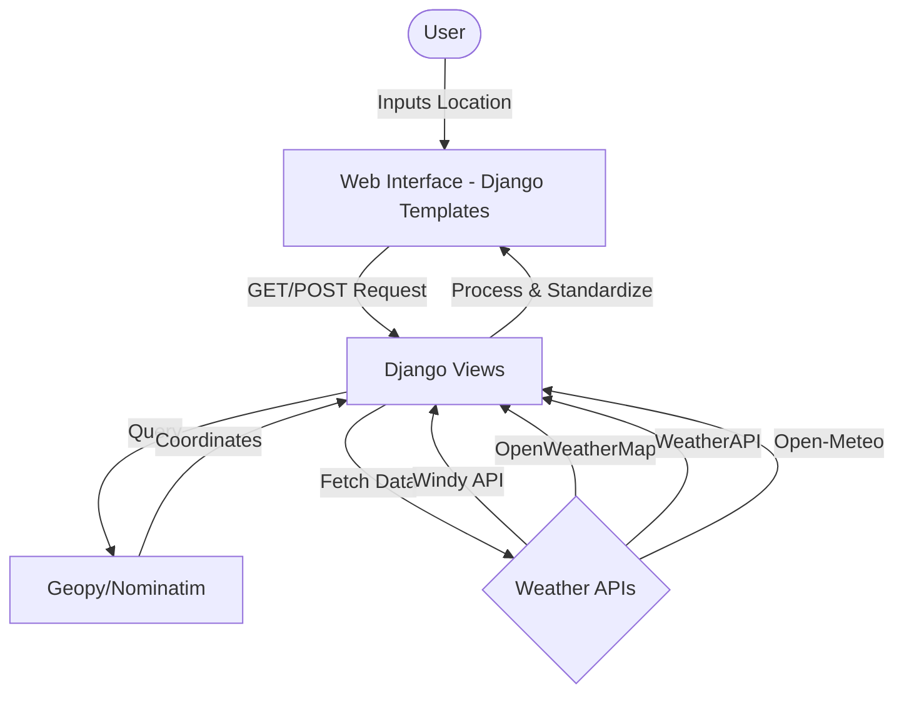

# Weather Analysis Tool

A comprehensive Django-based web application for weather data aggregation and analysis. This tool fetches forecasts from multiple world-class weather APIs, providing a centralized platform to compare meteorological data such as temperature, wind speed, pressure, and more.

______________________________________________________________________

## 📑 Table of Contents

1. [Introduction](#introduction)
1. [Key Features](#key-features)
1. [Architecture](#architecture)
1. [Technology Stack](#technology-stack)
1. [Weather API Providers](#weather-api-providers)
1. [Installation & Setup](#installation--setup)
1. [Environment Configuration](#environment-configuration)
1. [Project Structure](#project-structure)
1. [Usage](#usage)
1. [Screenshots](#screenshots)

______________________________________________________________________

## 🌟 Introduction

The **Weather Analysis Tool** is designed for users who need precise and multi-source weather forecasts. Instead of relying on a single provider, this application aggregates data from several APIs, allowing for a side-by-side comparison of predictions. It's particularly useful for meteorology enthusiasts, data analysts, or anyone who wants to verify weather trends across different models (like GFS).

## 🚀 Key Features

- **Multi-Source Aggregation:** Fetch data from Windy, OpenWeatherMap, WeatherAPI, and others.
- **Temperature Comparison:** Dedicated view to compare hourly temperature forecasts from all providers in a single table.
- **Geographic Flexibility:** Search for weather data for any location worldwide using geocoding.
- **Dynamic Metrics:** Includes temperature (standard & dew point), wind speed, pressure, relative humidity, and more.
- **User-Friendly Interface:** Clean, responsive UI built with Bootstrap.

## 🏗 Architecture

The application follows a standard Django MVT (Model-View-Template) architecture, integrating with external REST APIs and a geocoding service.



## 🛠 Technology Stack

- **Backend:** Python 3.x, Django 5.x
- **APIs & Libraries:**
  - `requests` & `aiohttp`: For API communication.
  - `geopy`: For converting city names to coordinates.
  - `python-weather`: Async weather fetching.
  - `open-meteo`: Dedicated client for Open-Meteo API.
- **Frontend:** HTML5, CSS3, JavaScript, Bootstrap.
- **Environment Management:** `python-dotenv`.

## ☁ Weather API Providers

| Provider             | Method            | Metrics Provided                                |
| :------------------- | :---------------- | :---------------------------------------------- |
| **Windy**            | POST (GFS Model)  | Wind, Dewpoint, RH, Pressure, Temp (calculated) |
| **OpenWeatherMap**   | GET               | Temp, Humidity, Pressure, Wind Speed            |
| **WeatherAPI**       | GET               | Real-time & Forecast, Humidity, Cloud cover     |
| **Open-Meteo**       | Client Library    | Hourly/Daily Forecast, UV Index, Precipitation  |
| **Weatherbit**       | GET               | Current & Forecast weather data                 |
| **Virtual Crossing** | GET               | Historical & Forecast data                      |
| **Python Weather**   | Async API Wrapper | Easy-to-use async forecast fetching             |

## ⚙ Installation & Setup

### Prerequisites

- Python 3.10+
- Virtual environment (recommended)

### Steps

1. **Clone the repository:**

   ```bash
   git clone https://github.com/your-username/weather_analysis.git
   cd weather_analysis
   ```

1. **Create and activate a virtual environment:**

   ```bash
   python -m venv venv
   source venv/bin/activate  # On Windows: venv\Scripts\activate
   ```

1. **Install dependencies:**

   ```bash
   pip install -r requirements.txt
   ```

1. **Initialize Database:**

   ```bash
   python manage.py migrate
   ```

1. **Run the server:**

   ```bash
   python manage.py runserver
   ```

## 🔑 Environment Configuration

Create a `.env` file in the project root and add your API keys:

```env
WINDY_API_KEY=your_windy_key
OPENWEATHERMAP_API_KEY=your_owm_key
WEATHERAPI_KEY=your_weatherapi_key
WEATHERBIT_API_KEY=your_weatherbit_key
VIRTUALCROSSING_API_KEY=your_vc_key
```

> **Note:** Open-Meteo is used without an API key for the free tier.

## 📂 Project Structure

```text
weather_analysis/
├── analyzer/               # Core application logic
│   ├── templatetags/       # Custom Django filters
│   ├── urls.py             # App-specific routing
│   └── views.py            # API integration & data processing
├── core/                   # Project configuration
│   └── settings.py         # Main settings
├── templates/              # HTML templates
│   ├── index.html          # Dashboard
│   ├── compare_temperatures.html # Comparison tool
│   └── ...                 # Provider-specific templates
├── static/                 # CSS, JS, and Images
├── manage.py               # Django management script
└── requirements.txt        # Project dependencies
```

## 🖥 Usage

1. Open your browser and navigate to `http://127.0.0.1:8000`.
1. Enter a city name (e.g., "London" or "Gdynia") in the search bar.
1. Choose a specific provider from the navigation menu to see detailed data.
1. Click on **"Compare"** to see a side-by-side temperature comparison for the next 48 hours.

______________________________________________________________________

*Supervised by Artur — Weather Analysis Tool © 2024*
